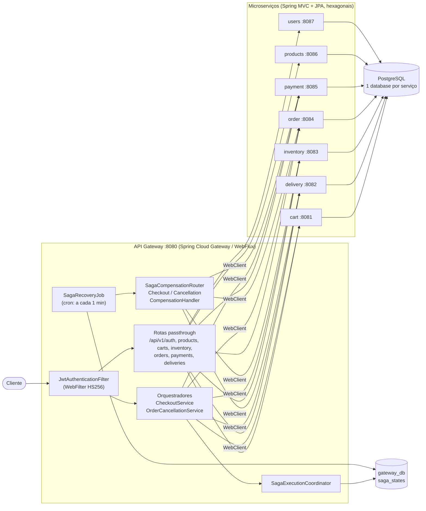
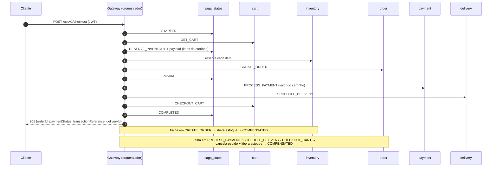

# E-commerce Microservices com Saga Orquestrada

[](https://github.com/TiagoAReiz/ecommerce-microservices-saga-orchestrator/actions/workflows/ci.yml)

Backend de e-commerce distribuído em **Spring Boot 4 / Java 17** que resolve o problema clássico de
transações entre microserviços com o padrão **Saga orquestrada**: o API Gateway coordena checkout e
cancelamento de pedidos entre carrinho, estoque, pedido, pagamento e entrega, **persiste o estado de
cada saga** e executa **compensações** quando um passo falha. Um job agendado
(`SagaRecoveryJob`) encontra sagas que ficaram presas (ex.: gateway caiu no meio do fluxo) e as
compensa automaticamente.

Cada microserviço segue **arquitetura hexagonal** (ports & adapters) e é dono do seu próprio banco.

## Destaques

- **Saga orquestrada com estado persistido** em `saga_states` (R2DBC reativo) — cada transição de passo é gravada antes da chamada remota.
- **Compensação em duas camadas**: imediata no fluxo reativo (falha síncrona) e tardia via `SagaRecoveryJob` (saga presa > 5 min), com roteamento por tipo de saga e limite de tentativas.
- **Gateway reativo** (Spring Cloud Gateway / WebFlux) que também é o orquestrador: rotas de passthrough para CRUD + endpoints próprios para os fluxos multi-serviço.
- **Autenticação completa**: o serviço `users` cadastra usuários (senha com BCrypt), emite access token JWT HS256 de curta duração (15 min) e refresh token opaco com rotação, detecção de reuso e logout. O gateway valida o token e repassa a identidade aos serviços. O segredo vem de variável de ambiente, sem default no código.
- **Autorização em duas camadas**: papéis `USER`/`ADMIN` aplicados centralmente no gateway (rota + método → papel exigido) e de novo nos serviços; cada serviço só devolve pedidos, pagamentos e entregas do próprio dono (404 para os de outros usuários). Admin é concedido por configuração (`ADMIN_EMAILS`), sem credencial fixa no código.
- **Database per service** + **Flyway** em todos os serviços, com `ddl-auto=validate` (o schema é versionado, o Hibernate só confere).
- **CI no GitHub Actions**: matriz com os 8 módulos Maven rodando os testes contra um PostgreSQL real.

## Arquitetura



| Serviço   | Porta (host) | Banco          | Responsabilidade |
|-----------|--------------|----------------|------------------|
| gateway   | 8080         | `gateway_db`   | Roteamento, JWT, orquestração das sagas, recuperação |
| cart      | 8081         | `cart_db`      | Carrinho e itens |
| delivery  | 8082         | `delivery_db`  | Agendamento e status de entrega |
| inventory | 8083         | `inventory_db` | Estoque disponível/reservado, reserva e liberação |
| order     | 8084         | `order_db`     | Ciclo de vida do pedido |
| payment   | 8085         | `payment_db`   | Registro de pagamento (autorização simulada) |
| products  | 8086         | `products_db`  | Catálogo |
| users     | 8087         | `users_db`     | Cadastro, login (BCrypt), JWT, refresh tokens e logout |

## Sagas

### Checkout — `POST /api/v1/checkout`



Compensação **imediata** (dentro do fluxo reativo, em `CheckoutService`):

| Passo que falhou | Ação | Status final |
|---|---|---|
| `GET_CART` (carrinho vazio) | nenhuma | `FAILED` |
| `RESERVE_INVENTORY` | nenhuma | `FAILED` |
| `CREATE_ORDER` | libera estoque | `COMPENSATED` |
| `PROCESS_PAYMENT`, `SCHEDULE_DELIVERY`, `CHECKOUT_CART` | cancela pedido + libera estoque | `COMPENSATED` |

### Cancelamento — `POST /api/v1/orders/{orderId}/cancel`

`GET_ORDER` (recusa `SHIPPED`/`DELIVERED` com 409; pedido inexistente ou de outro usuário → 404,
exceto para `ADMIN`) → `CANCEL_ORDER` → `RELEASE_INVENTORY` → `REFUND_PAYMENT` → `CANCEL_DELIVERY` →
`COMPLETED`.

### Recuperação — `SagaRecoveryJob`

Roda a cada minuto (`app.saga.recovery.cron`) e busca sagas em estado não terminal sem atualização há
mais de 5 minutos. Para cada uma:

1. Se `retryCount >= 3` → `FAILED` definitivo.
2. Senão incrementa `retryCount`, marca `COMPENSATING` e delega ao `SagaCompensationRouter`:
   - **CHECKOUT** — a partir do passo em que parou, executa (best-effort) cancelar entrega, estornar pagamento, cancelar pedido e liberar estoque (lido do `payload` salvo antes da reserva). Sucesso → `COMPENSATED`; erro → `FAILED`.
   - **ORDER_CANCELLATION** — se parou em `CANCEL_ORDER`, volta o pedido para `PENDING`; passos posteriores são irreversíveis e ficam registrados em log para intervenção manual.

O contador de tentativas protege contra sagas que voltam a ficar presas em `COMPENSATING` (ex.: o
gateway reiniciou durante a compensação).

## Como rodar

Pré-requisitos: **Docker** com Docker Compose v2. (Java 17 + Maven 3.9 só para rodar testes fora do Docker.)

```bash
git clone https://github.com/TiagoAReiz/ecommerce-microservices-saga-orchestrator.git
cd ecommerce-microservices-saga-orchestrator

cp .env.example .env        # opcional: sem .env o compose usa os mesmos defaults de dev
# para ter um administrador, defina ADMIN_EMAILS no .env (veja "Autenticação e autorização")
docker compose up --build -d
docker compose ps           # aguarde todos os serviços subirem (~1 min)
```

O PostgreSQL cria um banco por serviço no primeiro start (`infra/postgres/init-databases.sql`) e o
Flyway de cada serviço aplica as migrations. Para recomeçar do zero: `docker compose down -v`.
Se você já tinha o volume de uma versão anterior (sem `users_db`), rode `docker compose down -v` uma
vez para o script de criação dos bancos rodar de novo.

### Testando o fluxo completo

Cadastre um administrador e um cliente e use os tokens retornados (os exemplos usam `jq` para ler o
JSON). O administrador precisa estar em `ADMIN_EMAILS` — por exemplo `ADMIN_EMAILS=admin@example.com`
no `.env` antes do `docker compose up` (veja [Administradores](#administradores)).

```bash
H='Content-Type: application/json'
PRODUCT_ID=22222222-2222-2222-2222-222222222222

# 1. cadastro -> 201 {token, tokenType, expiresIn, refreshToken, userId, username, roles}
#    (usuário ou e-mail repetido -> 409)
ADMIN=$(curl -s -X POST localhost:8080/api/v1/auth/register -H "$H" \
  -d '{"username":"admin","email":"admin@example.com","password":"s3cret-pass"}')
ADMIN_AUTH="Authorization: Bearer $(echo "$ADMIN" | jq -r .token)"   # roles: ["USER","ADMIN"]

curl -s -X POST localhost:8080/api/v1/auth/register -H "$H" \
  -d '{"username":"alice","email":"alice@example.com","password":"s3cret-pass"}'

# 2. login -> 200 {token, refreshToken, userId, ...}  (credenciais erradas -> 401)
LOGIN=$(curl -s -X POST localhost:8080/api/v1/auth/login -H "$H" \
  -d '{"username":"alice","password":"s3cret-pass"}')
TOKEN=$(echo "$LOGIN" | jq -r .token)
REFRESH=$(echo "$LOGIN" | jq -r .refreshToken)
USER_ID=$(echo "$LOGIN" | jq -r .userId)
AUTH="Authorization: Bearer $TOKEN"

# 3. estoque: operação de back-office -> só ADMIN (com o token da alice -> 403)
curl -s -X POST localhost:8080/api/v1/inventory/stock -H "$H" -H "$ADMIN_AUTH" \
  -d "{\"productId\":\"$PRODUCT_ID\",\"quantityAvailable\":10,\"quantityReserved\":0}"

# 4. item no carrinho (o {userId} da URL precisa ser o do token, senão 403)
curl -s -X POST localhost:8080/api/v1/carts/$USER_ID/items -H "$H" -H "$AUTH" \
  -d "{\"productId\":\"$PRODUCT_ID\",\"quantity\":2,\"priceAtAddition\":49.90}"

# 5. checkout (saga) -> 201. Não há userId no corpo: o comprador é sempre o usuário do token.
ORDER_ID=$(curl -s -X POST localhost:8080/api/v1/checkout -H "$H" -H "$AUTH" \
  -d '{"shippingAddressId":"33333333-3333-3333-3333-333333333333","currency":"BRL","paymentMethod":"CREDIT_CARD"}' \
  | jq -r .orderId)

# 6. o pedido é visível para a dona e para o admin; para qualquer outro usuário -> 404
curl -s localhost:8080/api/v1/orders/$ORDER_ID -H "$AUTH"

# 7. estado das sagas
docker compose exec postgres psql -U admin -d gateway_db \
  -c "select saga_type, current_step, status, retry_count from saga_states order by created_at"
```

Repetir o checkout com `quantity` maior que o estoque mostra a saga falhando em `RESERVE_INVENTORY`.

Renovação e logout:

```bash
# troca o refresh token por um novo par; o refresh token antigo deixa de valer (rotação)
NEW=$(curl -s -X POST localhost:8080/api/v1/auth/refresh -H "$H" -d "{\"refreshToken\":\"$REFRESH\"}")
NEW_REFRESH=$(echo "$NEW" | jq -r .refreshToken)

# reusar o refresh token antigo -> 401 e a sessão inteira é revogada (o NEW_REFRESH também para de valer)
curl -s -o /dev/null -w '%{http_code}\n' -X POST localhost:8080/api/v1/auth/refresh -H "$H" \
  -d "{\"refreshToken\":\"$REFRESH\"}"

# logout -> 204; revoga a sessão do refresh token informado
curl -s -o /dev/null -w '%{http_code}\n' -X POST localhost:8080/api/v1/auth/logout -H "$H" \
  -d "{\"refreshToken\":\"$NEW_REFRESH\"}"
```

### Testes

```bash
cd order/order && mvn test    # o mesmo para cada serviço
```

Os testes `@SpringBootTest` sobem o contexto completo e precisam de um PostgreSQL acessível
(`SPRING_DATASOURCE_URL`, ou `SPRING_R2DBC_URL`/`SPRING_FLYWAY_URL` no gateway) — exatamente o que
o workflow de CI faz. Os demais são testes unitários e de controller (`@WebMvcTest`) e, no gateway,
testes de saga com `MockWebServer`.

Cobertura de controle de acesso: `JwtAuthenticationFilterTest` e `GatewayAccessControlTest` (gateway
real com os serviços simulados: sem token → 401, `USER` em rota de admin → 403 e nada é repassado,
`ADMIN` → repassado com a identidade verificada), `*AccessControlTest` em order/payment/delivery/
inventory/products (dono → 200, outro usuário → 404, admin → 200, escrita por `USER` → 403) e, no
`users`, `AuthServiceTest` + `AuthFlowIntegrationTest` (rotação, reuso revogando a família, logout,
refresh expirado, `ADMIN_EMAILS`) contra o PostgreSQL real.

## Endpoints

Tudo passa pelo gateway em `http://localhost:8080`. Exceto `/api/v1/auth/**` e a **leitura** do
catálogo (`GET /api/v1/products/**`), todas as rotas exigem `Authorization: Bearer <jwt>`. O gateway
descarta `X-User-Id`/`X-User-Roles` enviados pelo cliente e repassa aos serviços os valores extraídos
do token (`sub` e `roles`).

Legenda: **público** · **usuário** (qualquer token válido) · **dono** (só o próprio usuário ou `ADMIN`;
recurso de outro usuário → 404, ou 403 nas rotas com `{userId}`) · **admin** (exige `ADMIN`, senão 403).

| Recurso | Endpoints |
|---|---|
| Autenticação | público: `POST /api/v1/auth/register` (201; 409 se usuário/e-mail já existe), `POST /api/v1/auth/login` (200; 401), `POST /api/v1/auth/refresh` (200; 401 se inválido/expirado/reusado), `POST /api/v1/auth/logout` (204) |
| Checkout (saga) | usuário: `POST /api/v1/checkout` |
| Cancelamento (saga) | dono: `POST /api/v1/orders/{orderId}/cancel` |
| Produtos | público: `GET /api/v1/products`, `GET /api/v1/products/{id}` · admin: `POST /api/v1/products`, `PUT/DELETE /api/v1/products/{id}` |
| Carrinho | dono: `GET/DELETE /api/v1/carts/{userId}`, `POST /api/v1/carts/{userId}/items`, `DELETE /api/v1/carts/{userId}/items/{productId}`, `POST /api/v1/carts/{userId}/checkout` |
| Estoque | usuário: `GET /api/v1/inventory/{productId}` · admin: `POST /api/v1/inventory/stock`, `/reserve`, `/release` |
| Pedidos | dono: `GET /api/v1/orders/{id}`, `GET /api/v1/orders/user/{userId}` · admin: `POST /api/v1/orders`, `PATCH /api/v1/orders/{id}/status?status=` |
| Pagamentos | dono: `GET /api/v1/payments/{id}`, `GET /api/v1/payments/order/{orderId}` (só os pagamentos do chamador) · admin: `POST /api/v1/payments` |
| Entregas | dono: `GET /api/v1/deliveries/{id}`, `GET /api/v1/deliveries/order/{orderId}` · admin: `POST /api/v1/deliveries`, `PATCH /api/v1/deliveries/{id}/status?status=` |

Erros de validação retornam `400` com `{"status":400,"error":"Validation failed","fields":{...}}`.

## Autenticação e autorização

**Tokens.** Login e cadastro devolvem um *access token* JWT HS256 (`sub` = id do usuário, `roles`),
válido por 15 minutos (`JWT_EXPIRATION_MS`), e um *refresh token* opaco (256 bits aleatórios) válido
por 7 dias (`JWT_REFRESH_EXPIRATION_MS`). O refresh token é guardado só como hash SHA-256 na tabela
`refresh_tokens` do `users_db` (migration `V2__refresh_tokens.sql`).

**Rotação e reuso.** `POST /api/v1/auth/refresh` revoga o refresh token apresentado e devolve um novo
par (o novo token pertence à mesma *família*, isto é, à mesma sessão de login). A revogação é um
compare-and-set atômico no banco, então duas renovações simultâneas com o mesmo token não geram duas
sessões. Se um token já revogado for apresentado de novo, alguém o copiou: a família inteira é revogada
e o usuário precisa fazer login outra vez. Os papéis são relidos do banco a cada renovação.

**Logout.** `POST /api/v1/auth/logout` revoga a família do refresh token informado (responde 204 mesmo
para token desconhecido, para não servir de oráculo).

**Revogação do access token — escolha consciente.** O gateway valida o JWT sem estado (só assinatura e
expiração), sem consultar o `users`. Por isso logout, reuso detectado ou mudança de papel valem para o
access token só quando ele expira — no máximo 15 minutos. Uma denylist de `jti` ou um `tokenVersion`
exigiria que o gateway consultasse um armazenamento compartilhado (Redis ou o próprio `users`) em toda
requisição; para este projeto o TTL curto é o equilíbrio escolhido.

**Papéis.** Todo usuário recebe `USER`. `ADMIN` libera as operações de back-office (escrita no catálogo
e no estoque, criação de pedidos/pagamentos/entregas fora da saga e os `PATCH .../status`) e a leitura
de recursos de qualquer usuário. As regras ficam centralizadas no gateway (`app.jwt.public-paths`,
`app.security.admin-paths` e `app.jwt.user-scoped-paths` no `application.yml`, no formato
`"MÉTODO|MÉTODO /padrão/ant/**"`). Caminhos não normalizados (`..`, `//`, `;`) são recusados com 400
para que nenhuma regra seja contornada por truques de path.

**Posse dos recursos.** Só o serviço dono sabe quem é o dono de um pedido, pagamento ou entrega, então a
checagem acontece nele, a partir do `X-User-Id`/`X-User-Roles` que o gateway repassa: recurso de outro
usuário responde **404** (não revela que o id existe); `ADMIN` passa. Pagamentos e entregas passaram a
gravar `user_id` (migrations `V2__*_owner.sql`); linhas anteriores ficam sem dono e só `ADMIN` as vê. Os
serviços também recusam com 403 as operações de admin quando o chamador é um `USER` (defesa em
profundidade caso uma regra do gateway falte).

### Administradores

Não há usuário nem senha de admin no código. Liste e-mails em `ADMIN_EMAILS` (separados por vírgula,
sem diferenciar maiúsculas) no serviço `users`; a conta com esse e-mail recebe `ADMIN` no cadastro, no
login ou no próximo refresh, e o papel fica gravado em `users.roles`.

O serviço não verifica e-mails, então **quem se cadastrar primeiro com um e-mail listado vira admin**.
O caminho seguro é: cadastre a conta normalmente, depois adicione o e-mail dela a `ADMIN_EMAILS` e
reinicie o `users` (`docker compose up -d users`); o papel é aplicado no próximo login. Como o e-mail é
único, ninguém mais consegue registrá-lo.

Tirar um e-mail de `ADMIN_EMAILS` não rebaixa a conta. Para revogar:

```bash
docker compose exec postgres psql -U admin -d users_db \
  -c "update users set roles = 'USER' where email = 'admin@example.com'"
```

O access token já emitido continua com `ADMIN` até expirar (≤ 15 min); a partir do próximo refresh o
papel some.

## Configuração

| Variável | Onde | Default de dev (compose) |
|---|---|---|
| `JWT_SECRET` | users (assina) e gateway (valida) — **obrigatória**, mesmo valor nos dois, sem default no código | `dev-only-insecure-jwt-secret-change-me-...` |
| `JWT_EXPIRATION_MS` | users — validade do access token | `900000` (15 min) |
| `JWT_REFRESH_EXPIRATION_MS` | users — validade de cada refresh token | `604800000` (7 dias) |
| `ADMIN_EMAILS` | users — e-mails que recebem `ADMIN` (vírgula) | vazio (nenhum admin) |
| `POSTGRES_USER` / `POSTGRES_PASSWORD` | postgres + todos os serviços | `admin` / `adminpassword` |
| `SPRING_DATASOURCE_URL` | serviços JPA | `jdbc:postgresql://postgres:5432/<serviço>_db` |
| `SPRING_R2DBC_URL` / `SPRING_FLYWAY_URL` | gateway | `.../gateway_db` |
| `*_SERVICE_URL` | gateway (rotas + WebClient) | `http://<serviço>:8080` |

Os defaults do `application.yml` do gateway apontam para as portas publicadas pelo compose, então dá
para rodar o gateway pela IDE contra os serviços em Docker.

## Decisões de design

- **Orquestração em vez de coreografia.** O fluxo de checkout tem ordem rígida e compensações que dependem do passo atual; um orquestrador central deixa isso explícito, testável e observável numa única tabela, ao custo de acoplar o gateway aos contratos dos serviços.
- **Gateway = orquestrador.** Evita mais um serviço e um hop de rede neste escopo. Em produção o orquestrador provavelmente viraria um serviço próprio para escalar e implantar independente do edge.
- **Estado da saga antes da chamada remota.** `updateStep` persiste o passo antes de chamar o serviço e os itens do carrinho vão para o `payload` antes da reserva — é isso que permite ao `SagaRecoveryJob` saber o que desfazer depois de um crash.
- **Compensação best-effort + job de recuperação.** A compensação imediata cobre falhas síncronas; o job cobre o que a compensação imediata não alcança (processo morto, timeout). Cada ação de compensação loga e segue, para não deixar a saga pela metade.
- **HTTP síncrono (WebClient) em vez de broker.** Mantém o projeto simples de subir e depurar. O preço é disponibilidade acoplada: se um serviço cai, a saga falha e compensa em vez de esperar numa fila.
- **R2DBC no gateway, JPA nos serviços.** O gateway é reativo ponta a ponta (WebFlux + R2DBC); o Flyway roda via JDBC só para migrations. Os serviços de domínio usam Spring MVC + JPA, mais simples para CRUD.
- **IDs gerados no domínio.** As entidades de domínio criam o próprio UUID; a camada JPA/R2DBC não gera IDs (a saga implementa `Persistable` para o Spring Data diferenciar INSERT de UPDATE).
- **Database per service.** Um único container PostgreSQL por praticidade, mas um banco por serviço — nenhum serviço lê a tabela de outro e cada um tem seu histórico do Flyway.

## Limitações conhecidas / próximos passos

Estado atual, sem maquiagem:

- **Estorno de pagamento é placeholder**: o serviço de pagamento não tem endpoint de refund; o orquestrador localiza o pagamento e apenas registra em log.
- **Pedido não calcula preço**: o serviço `order` grava `unitPrice`/`totalAmount` como 0 (não consulta o catálogo). O valor cobrado vem do snapshot do carrinho (`priceAtAddition`).
- **Reserva parcial**: com vários itens, se a reserva de um falhar, os já reservados no mesmo passo não são liberados (a falha em `RESERVE_INVENTORY` não dispara compensação).
- **Compensação imediata não estorna pagamento nem cancela entrega** quando a falha ocorre em `SCHEDULE_DELIVERY`/`CHECKOUT_CART`; isso só existe no handler do job de recuperação.
- **Controle de acesso — o que está coberto**: papéis `USER`/`ADMIN` no gateway e nos serviços; posse de pedidos, pagamentos, entregas, carrinho e cancelamento (404/403 para outros usuários, `ADMIN` passa); catálogo público só para leitura; refresh token com rotação, detecção de reuso e logout; admin via `ADMIN_EMAILS`.
- **Controle de acesso — o que ainda falta**:
  - Access token não é revogável antes de expirar (até 15 min após logout/reuso/rebaixamento), por design (ver [Autenticação e autorização](#autenticação-e-autorização)).
  - Os serviços confiam no gateway: chamadas sem `X-User-Id` são tratadas como chamadas internas da saga. Isso só é seguro porque os serviços não deveriam ser acessíveis de fora; o `docker-compose` publica as portas deles no host para facilitar o desenvolvimento, o que em produção precisa ser fechado (rede interna ou mTLS/token de serviço).
  - Sem verificação de e-mail (relevante para `ADMIN_EMAILS`), sem rate limiting em login/refresh e sem limpeza periódica de refresh tokens expirados.
  - Pagamentos e entregas criados antes desta versão não têm dono gravado e só são visíveis a `ADMIN`.
- **Observabilidade mínima**: logs apenas; sem Actuator, métricas ou tracing distribuído.
- **Sem idempotência/retry nas chamadas** entre serviços e sem testes de integração ponta a ponta automatizados (a saga de checkout foi verificada manualmente via compose; autenticação e controle de acesso são cobertos por testes unitários, de controller, de contrato do JWT e de integração com PostgreSQL por serviço).

## Estrutura

```
gateway/gateway/          # Gateway + orquestrador (controller, service, saga, filter, entity, repository)
cart/                     # \
delivery/delivery/        #  |
inventory/inventory/      #  |  microserviços hexagonais:
order/order/              #  |  core/entities · application/{ports,services,mappers}
payment/payment/          #  |  · infrastructure/adapters/{in/controllers, out/repositories}
products/products/        # /
users/                    # autenticação: cadastro, login, JWT, refresh tokens e logout (hexagonal)
infra/postgres/           # script de criação dos bancos
openspec/, gateway-orchestrator-architecture.md   # proposta e design originais do orquestrador
```
